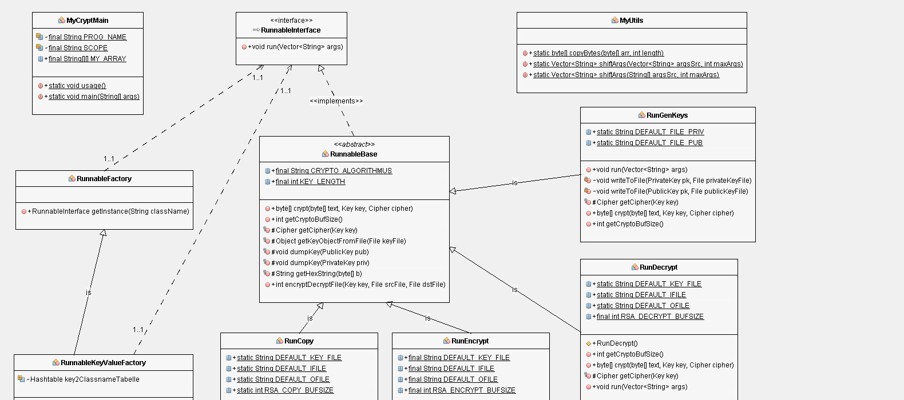

# Java Crypt


## Install Java
The first thing to do is to install java. This works differently with each operating system.
```shell
sudo apt update && sudo apt upgrade -y
sudo apt install -y coreutils default-jre default-jdk dos2unix
```

## Build Project
The commands for Java are platform independent. Therefore, it doesn't matter if you run it on Linux or Windows.

### Makefile
- Linux
```bash
dos2unix makefile.sh
sudo sh makefile.sh
```
- Windows
```powershell
./makefile.cmd
```

### Self Build
#### Build Class
The command ``javac -Xlint:unchecked ./javacrypt/*.java`` compiles all the Java files in the ``./javacrypt`` directory with the ``-Xlint:unchecked`` option to display warnings for unchecked operations.

```shell
javac -Xlint:unchecked ./javacrypt/*.java
```


#### Build  JAR-File
The command ``jar cfm MyCrypt.jar ./makefile.txt javacrypt/*.class`` creates a JAR (Java Archive) file named ``MyCrypt.jar`` with the specified manifest file (``makefile.txt``) and includes all the class files (``*.class``) in the ``javacrypt`` directory.

```shell
 jar cfm JavaCrypt.jar manifest.mf javacrypt/*.class
```

## Run JavaCrypt

### Start Programm
```shell
java -jar JavaCrypt.jar
```

### Generate Keys 
Before you can use the encryption, you need to generate it with keys. The keys are stored in binary form. Therefore, they cannot be opened with a normal editor. The public key is needed for encryption and the private key for decryption. 

```shell
java -jar JavaCrypt.jar -genkeys <PUBLIC-KEY> <PRIVATE-KEY>
```

### Encrypt Files 
For the encryption you need three files. A public key, the file to be encrypted and the output file. With the flag "-encrypt" and the correct specification of the files the file will be encrypted.
```shell
java -jar JavaCrypt.jar -encrypt <PUBLIC-KEY> <FILE> <ENCRYPTED-FILE>
```


### Decrypt Files 
For decryption, you need three files. A private key, the file to be decrypted and the output file. By the flag "-decrypt" and the correct specification of the files the file is decrypted. 
```shell
java -jar JavaCrypt.jar -decrypt <PRIVATE-KEY>  <ENCRYPTED-FILE> <DECRYPT-FILE> 
```


### Copy Files
The copying of files is a function that has arisen more through the others. For this reason one must also specify a "dummy word". But it doesn't matter which string you enter, because it will be ignored. 

```shell
java -jar JavaCrypt.jar -copy dummy text.txt text_copy.txt
```

## Usage
```bash
➜  JavaCrypt git:(main) ✗ javac -Xlint:unchecked ./javacrypt/*.java

➜  JavaCrypt git:(main) ✗ jar cfm JavaCrypt.jar manifest.mf javacrypt/*.class

➜  JavaCrypt git:(main) ✗ java -jar JavaCrypt.jar
Program 'JavaCrypt'
Usage:
        JavaCrypt -genkeys [priv_keyfile] [pub_keyfile]
        JavaCrypt -encrypt [pub_keyfile] [ifile] [ofile]
        JavaCrypt -decrypt [privkeyfile] [ifile] [ofile]
        JavaCrypt -copy [dummyword] [ifile]  [ofile]


➜  JavaCrypt git:(main) ✗ java -jar JavaCrypt.jar -genkeys priv.key pub.key
RunGenKeys
Private key file: /mnt/e/git_eskopp/JavaCrypt/priv.key
Public key file: /mnt/e/git_eskopp/JavaCrypt/pub.key
End of the program.

➜  JavaCrypt git:(main) ✗ echo "Hello World" > test.txt

➜  JavaCrypt git:(main) ✗ java -jar JavaCrypt.jar -encrypt pub.key test.txt test_encrypt.txt
RunEncrypt
Number of bytes transferred: 128
End of the program.

➜  JavaCrypt git:(main) ✗  cat test_encrypt.txt
...


➜  JavaCrypt git:(main) ✗ java -jar JavaCrypt.jar -decrypt priv.key test_encrypt.txt test_decrypt.txt
RunDecrypt
Number of bytes transferred: 128
End of the program.

➜  JavaCrypt git:(main) ✗ cat test_decrypt.txt
Hello World
```


## Program architecture
Here is the UML plan of the project. 


